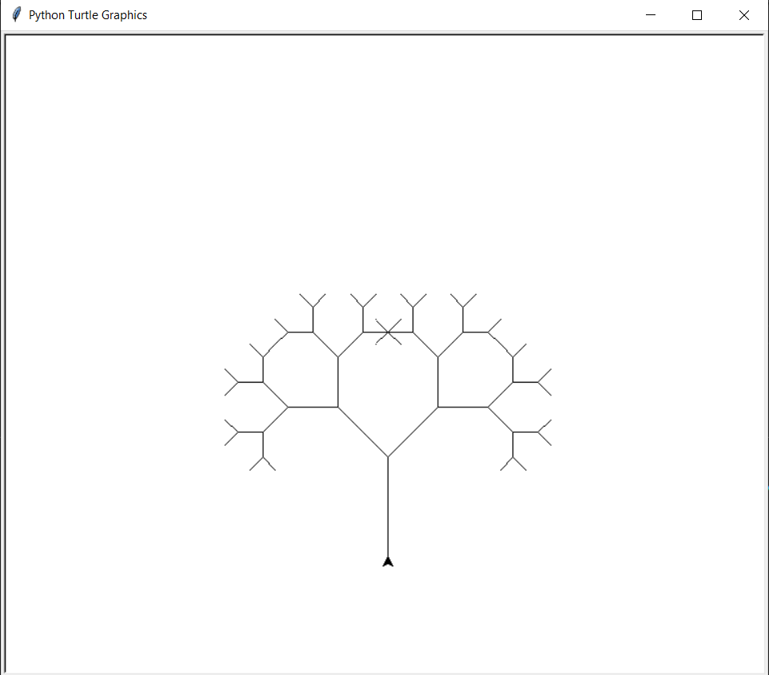
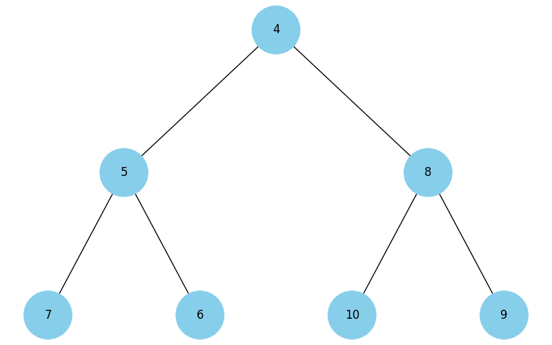

# Покрокова інструкція виконання фінального проєкту

## Завдання 1. Структури даних. Сортування. Робота з однозв'язним списком

Для реалізації однозв'язного списку (приклад реалізації можна взяти з конспекту) необхідно:

написати функцію, яка реалізує реверсування однозв'язного списку, змінюючи посилання між вузлами;
розробити алгоритм сортування для однозв'язного списку, наприклад, сортування вставками або злиттям;
написати функцію, що об'єднує два відсортовані однозв'язні списки в один відсортований список.

## Завдання 2. Рекурсія. Створення фрактала “дерево Піфагора” за допомогою рекурсії

Необхідно написати програму на Python, яка використовує рекурсію для створення фрактала “дерево Піфагора”. Програма має візуалізувати фрактал “дерево Піфагора”, і користувач повинен мати можливість вказати рівень рекурсії.

## Завдання 3. Дерева, алгоритм Дейкстри

Розробіть алгоритм Дейкстри для знаходження найкоротших шляхів у зваженому графі, використовуючи бінарну купу. Завдання включає створення графа, використання піраміди для оптимізації вибору вершин та обчислення найкоротших шляхів від початкової вершини до всіх інших.

## Завдання 4. Візуалізація піраміди

Наступний код виконує побудову бінарних дерев. Виконайте аналіз коду, щоб зрозуміти, як він працює.

```
import uuid

import networkx as nx
import matplotlib.pyplot as plt


class Node:
  def __init__(self, key, color="skyblue"):
    self.left = None
    self.right = None
    self.val = key
    self.color = color # Додатковий аргумент для зберігання кольору вузла
    self.id = str(uuid.uuid4()) # Унікальний ідентифікатор для кожного вузла


def add_edges(graph, node, pos, x=0, y=0, layer=1):
  if node is not None:
    graph.add_node(node.id, color=node.color, label=node.val) # Використання id та збереження значення вузла
    if node.left:
      graph.add_edge(node.id, node.left.id)
      l = x - 1 / 2 ** layer
      pos[node.left.id] = (l, y - 1)
      l = add_edges(graph, node.left, pos, x=l, y=y - 1, layer=layer + 1)
    if node.right:
      graph.add_edge(node.id, node.right.id)
      r = x + 1 / 2 ** layer
      pos[node.right.id] = (r, y - 1)
      r = add_edges(graph, node.right, pos, x=r, y=y - 1, layer=layer + 1)
  return graph


def draw_tree(tree_root):
  tree = nx.DiGraph()
  pos = {tree_root.id: (0, 0)}
  tree = add_edges(tree, tree_root, pos)

  colors = [node[1]['color'] for node in tree.nodes(data=True)]
  labels = {node[0]: node[1]['label'] for node in tree.nodes(data=True)} # Використовуйте значення вузла для міток

  plt.figure(figsize=(8, 5))
  nx.draw(tree, pos=pos, labels=labels, arrows=False, node_size=2500, node_color=colors)
  plt.show()


# Створення дерева
root = Node(0)
root.left = Node(4)
root.left.left = Node(5)
root.left.right = Node(10)
root.right = Node(1)
root.right.left = Node(3)

# Відображення дерева
draw_tree(root)
```

Використовуючи як базу цей код, побудуйте функцію, що буде візуалізувати бінарну купу.

### Примітка. Суть завдання полягає у створенні дерева із купи.

## Завдання 5. Візуалізація обходу бінарного дерева

Використовуючи код із завдання 4 для побудови бінарного дерева, необхідно створити програму на Python, яка візуалізує обходи дерева: у глибину та в ширину.

Вона повинна відображати кожен крок у вузлах з різними кольорами, використовуючи 16-систему RGB (приклад #1296F0). Кольори вузлів мають змінюватися від темних до світлих відтінків, залежно від послідовності обходу. Кожен вузол при його відвідуванні має отримувати унікальний колір, який візуально відображає порядок обходу.

### Примітка. Використовуйте стек та чергу, НЕ рекурсію

# Завдання 6. Жадібні алгоритми та динамічне програмування

Необхідно написати програму на Python, яка використовує два підходи — жадібний алгоритм та алгоритм динамічного програмування для розв’язання задачі вибору їжі з найбільшою сумарною калорійністю в межах обмеженого бюджету.

Кожен вид їжі має вказану вартість і калорійність. Дані про їжу представлені у вигляді словника, де ключ — назва страви, а значення — це словник з вартістю та калорійністю.

```
items = {
    "pizza": {"cost": 50, "calories": 300},
    "hamburger": {"cost": 40, "calories": 250},
    "hot-dog": {"cost": 30, "calories": 200},
    "pepsi": {"cost": 10, "calories": 100},
    "cola": {"cost": 15, "calories": 220},
    "potato": {"cost": 25, "calories": 350}
}
```

Розробіть функцію greedy_algorithm жадібного алгоритму, яка вибирає страви, максимізуючи співвідношення калорій до вартості, не перевищуючи заданий бюджет.

Для реалізації алгоритму динамічного програмування створіть функцію dynamic_programming, яка обчислює оптимальний набір страв для максимізації калорійності при заданому бюджеті.

## Завдання 7. Використання методу Монте-Карло

Необхідно написати програму на Python, яка імітує велику кількість кидків кубиків, обчислює суми чисел, які випадають на кубиках, і визначає ймовірність кожної можливої суми.

Створіть симуляцію, де два кубики кидаються велику кількість разів. Для кожного кидка визначте суму чисел, які випали на обох кубиках. Підрахуйте, скільки разів кожна можлива сума (від 2 до 12) з’являється у процесі симуляції. Використовуючи ці дані, обчисліть імовірність кожної суми.

На основі проведених імітацій створіть таблицю або графік, який відображає ймовірності кожної суми, виявлені за допомогою методу Монте-Карло.

Таблиця ймовірностей сум при киданні двох кубиків виглядає наступним чином.

Порівняйте отримані за допомогою методу Монте-Карло результати з аналітичними розрахунками, наведеними в таблиці вище.

# Критерії прийняття фiнального проєкту

## Завдання 1:

- Реалізовано функцію реверсування однозв'язного списку, яка змінює посилання між вузлами. Код виконується.

- Програмно реалізовано алгоритм сортування (функцію) для однозв'язного списку. Код виконується.

- Реалізовано функцію, що об'єднує два відсортовані однозв'язні списки в один відсортований список. Код виконується.

## Завдання 2:

- Код виконується. Програма візуалізує фрактал “дерево Піфагора”.

-Користувач має можливість вказати рівень рекурсії.

## Завдання 3:

- Програмно реалізовано алгоритм Дейкстри для знаходження найкоротшого шляху у графі з використанням бінарної купи (піраміди).

- У межах реалізації завдання створено граф, використано піраміду для оптимізації вибору вершин та виконано обчислення найкоротших шляхів від початкової вершини до всіх інших.

## Завдання 4:

- Код виконується. Функція візуалізує бінарну купу.

## Завдання 5:

- Програмно реалізовано алгоритми DFS і BFS для візуалізації обходу дерева в глибину та в ширину. Використано стек та чергу.

- Кольори вузлів змінюються від темних до світлих відтінків залежно від порядку обходу.

## Завдання 6:

- Програмно реалізовано функцію, яка використовує принцип жадібного алгоритму. Код виконується і повертає назви страв, максимізуючи співвідношення калорій до вартості, не перевищуючи заданий бюджет.

- Програмно реалізовано функцію, яка використовує принцип динамічного програмування. Код виконується і повертає оптимальний набір страв для максимізації калорійності при заданому бюджеті.

## Завдання 7:

- Програмно реалізовано алгоритм для моделювання кидання двох ігрових кубиків і побудови таблиці сум та їх імовірностей за допомогою методу Монте-Карло.

- Код виконується та імітує велику кількість кидків кубиків, обчислює суми чисел, які випадають на кубиках, підраховує, скільки разів кожна можлива сума з’являється у процесі симуляції, і визначає ймовірність кожної можливої суми.

- Створено таблицю або графік, який відображає ймовірності кожної суми, виявлені за допомогою методу Монте-Карло.

- Зроблено висновки щодо правильності розрахунків шляхом порівняння отриманих за допомогою методу Монте-Карло результатів та результатів аналітичних розрахунків. Висновки оформлено у вигляді файлу readme.md фінального завдання.


# Формат оцінювання:

### Оцінка від 0 до 100.

- Завдання 1 оцінюється в 15 балів.
- Завдання 2 оцінюється в 15 балів.
- Завдання 3 оцінюється в 10 балів.
- Завдання 4 оцінюється в 15 балів.
- Завдання 5 оцінюється в 15 балів.
- Завдання 6 оцінюється в 15 балів.
- Завдання 7 оцінюється в 15 балів.


# Результати та висновки виконання завдань:

## Завдання 1

Код реалізує основні операції з однозв'язним списком (Linked List), включаючи вставку, видалення, пошук, реверсування, сортування вставками та об'єднання списків.

### Результат виконання:

```
Оригінальний зв'язний список:
3 -> 7 -> 1 -> 4 -> 9 -> None     

Реверсований зв'язний список:     
9 -> 4 -> 1 -> 7 -> 3 -> None     

Відсортований зв'язний список:    
1 -> 3 -> 4 -> 7 -> 9 -> None     

Об'єднаний відсортований список:  
1 -> 2 -> 3 -> 4 -> 5 -> 6 -> None
```

### Ключові моменти

- Вставка елементів: Реалізовано методи для вставки елементів на початок, у кінець, а також після певного вузла.

- Реверсування: Метод reverse перевертає список, змінюючи порядок елементів на протилежний.

- Сортування вставками: Метод insertion_sort сортує елементи списку за допомогою алгоритму вставок.

- Об'єднання списків: Метод merge_sorted_lists з'єднує два відсортовані списки в один.

### Висновки

- Сортування вставками: Добре підходить для невеликих списків.

- Об'єднання списків: Оптимально поєднує два списки з часовою складністю 𝑂(𝑛)


## Завдання 2

Цей код реалізує програму на Python, яка малює фрактал "дерево Піфагора" за допомогою модуля turtle. Програма дозволяє користувачу вказати бажаний рівень рекурсії для побудови дерева.

### Результат виконання:



Запуск програми відкриє вікно, в якому буде побудована геометрична фігура - дерево Піфагора, з вказаним рівнем рекурсії, що складається з гілок що утворюють фрактальну структуру.

### Ключові моменти:

- Рекурсивна побудова гілок: Основна логіка побудови фракталу закладена у функції draw_pythagoras_tree, яка рекурсивно малює кожну гілку дерева. З кожним рівнем рекурсії гілки стають коротшими, і дерево розгалужується.

- Користувацький ввід: Програма запитує у користувача рівень рекурсії, що дозволяє налаштовувати деталізацію малюнка.

- Використання бібліотеки turtle: Бібліотека turtle забезпечує простий спосіб графічного виводу на екран, що ідеально підходить для побудови таких фрактальних структур.

### Висновки:

- Фрактали та рекурсія: Дерево Піфагора є класичним прикладом фракталу, який показує силу рекурсії в створенні складних і красивих геометричних форм.

- Візуалізація через turtle: Бібліотека turtle надає простий інтерфейс для візуалізації, що дозволяє ефективно малювати рекурсивні структури, такі як дерево Піфагора.

## Завдання 3

Код реалізує алгоритм Дейкстри для пошуку найкоротших шляхів у зваженому графі. Алгоритм використовує бінарну купу (heapq) для ефективного вибору вершини з найменшою вартістю.

### Результат виконання:

```
Найкоротші шляхи від вершини A:
До вершини A: 0 (Шлях: ['A'])
До вершини F: 11 (Шлях: ['A', 'C', 'F'])     
До вершини D: 20 (Шлях: ['A', 'C', 'D'])     
До вершини C: 9 (Шлях: ['A', 'C'])
До вершини B: 7 (Шлях: ['A', 'B'])
До вершини E: 20 (Шлях: ['A', 'C', 'F', 'E'])
```

### Ключові моменти:

- Реалізація графа: Граф представлено як набір вершин та ребер з вагою (відстанями). Це забезпечує зручну структуру для обчислення найкоротших шляхів.

- Алгоритм Дейкстри: Використано для пошуку найкоротших шляхів у графі з позитивними вагами. Алгоритм працює ефективно завдяки використанню бінарної купи для зберігання вершини з найменшою поточною відстанню.

- Реконструкція шляху: Після виконання алгоритму, шлях від початкової до будь-якої вершини можна відтворити за допомогою словника попередніх вершин.

### Висновки:

- Ефективність алгоритму: Алгоритм Дейкстри, реалізований з використанням бінарної купи, забезпечує оптимальний час виконання для графів із позитивними вагами. Це робить його придатним для широкого спектра задач у теорії графів.

- Практичне застосування: Реалізація алгоритму дозволяє ефективно обчислювати найкоротші шляхи в різних типах мереж, включаючи дорожні системи, комп'ютерні мережі, та інші подібні структури.

## Завдання 4

Код реалізує програму для побудови та візуалізації бінарної купи у вигляді бінарного дерева. Програма використовує бібліотеки networkx та matplotlib для створення та відображення графічного представлення дерева.

### Результат виконання:



Бінарне дерево, побудоване з бінарної купи, візуалізоване у вигляді піраміди.

### Ключові моменти:

- Побудова дерева: Використовується клас Node для представлення вузлів дерева та функція build_heap_tree для побудови дерева з масиву, що представляє бінарну купу.

- Візуалізація: Функція draw_tree відповідає за візуалізацію побудованого дерева за допомогою networkx та matplotlib.

- Додаткові можливості: Код включає можливість налаштування кольору вузлів та їх унікальних ідентифікаторів для кращої візуалізації.

### Висновки:

- Візуалізація бінарної купи: Програма наочно демонструє структуру бінарної купи у вигляді дерева, що дозволяє краще зрозуміти її властивості та порядок елементів.

- Застосування: Така візуалізація може бути корисною для навчання, аналізу алгоритмів та структур даних, пов'язаних із бінарними купами.


## Завдання 5

Код реалізує програму для візуалізації обходу бінарного дерева, побудованого з бінарної купи, з використанням алгоритмів обходу в глибину (DFS) та в ширину (BFS). Вузли дерева змінюють свої кольори відповідно до порядку обходу.

### Результат виконання:

Візуалізація обходу дерева в глибину (DFS) та в ширину (BFS) з використанням градієнта кольорів, що змінюються від темного до світлого відтінку залежно від послідовності обходу.

")

")

### Ключові моменти:

Побудова дерева: Вузли бінарної купи представлені як об'єкти класу Node, які об'єднуються в дерево за допомогою функції build_heap_tree.

Алгоритми обходу: Використовуються алгоритми DFS (з використанням стеку) та BFS (з використанням черги) для обходу дерева.

Візуалізація: Градієнт кольорів застосовується до вузлів дерева відповідно до порядку обходу, що наочно відображає процес проходження по вузлах.

### Висновки:

- Обхід дерева: Програма дозволяє наочно побачити різницю між обходом дерева в глибину та в ширину.

- Візуалізація: Використання кольорів для позначення порядку обходу робить процес більш зрозумілим та зручним для аналізу, що корисно для навчання та вивчення алгоритмів обходу дерев.

## Завдання 6


## Завдання 7


